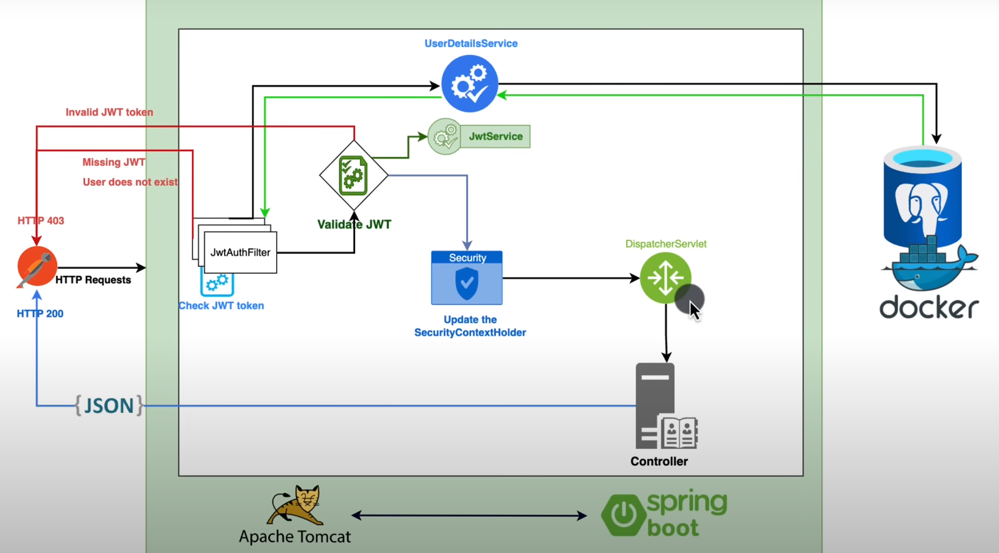

# Spring boot 3.0 - Secure your API with JWT Token [2023]

Curso tomado del canal de [**Bouali Ali**](https://www.youtube.com/watch?v=BVdQ3iuovg0)

---

## Diagrama sobre el mecanismo usado para la validación de JWT



## [12:28] Connect to the database

Establecemos las configuraciones en el **application.properties** para conectarnos a la bd de postgresql. Tener en
cuenta, que previamente creamos la base de datos **db_spring_security_jwt** usando **DBeaver**.

````properties
# Datasource
spring.datasource.url=jdbc:postgresql://localhost:5432/db_spring_security_jwt
# Ayudará a Spring para detectar o usar le mejor nombre de clase de controlador
spring.datasource.driver-class-name=org.postgresql.Driver
spring.datasource.username=postgres
spring.datasource.password=magadiflo
#
# Jpa
spring.jpa.hibernate.ddl-auto=create-drop
spring.jpa.show-sql=true
spring.jpa.properties.hibernate.format_sql=true
# Le decimos qué base de datos estamos usando
spring.jpa.database=postgresql
# Ayudará a Spring a realizar y escribir las mejores consultas para adaptarse a nuestra base de datos postgres SQL
spring.jpa.database-platform=org.hibernate.dialect.PostgreSQLDialect
````

## [17:12] Create user class

Creamos nuestra clase User agregándole anotaciones de **lombok**, estas anotaciones nos permitirán tener el código
más limpio.

````java

@Data
@Builder
@NoArgsConstructor
@AllArgsConstructor
public class User {
    private Integer id;
    private String firstName;
    private String lastName;
    private String email;
    private String password;
}
````

## [20:05] Transform the User to an entity

Para convertir nuestra clase User en una entidad, debemos usar la anotación **@Entity**. Ahora, dado que estamos usando
**Spring Boot 3**, en esta versión debemos asegurarnos que el paquete a importar para dicha anotación sea de
**jakarta.persistence** y ya no de **javax.persistence**, ya que este último le corresponde a la versión de
Spring Boot 2. De igual forma, debemos importar de **jakarta.persistence** las anotaciones: **@Id, @GeneratedValue(...),
@Table(...), etc**.

A continuación se muestra nuestra clase de entidad ya completa:

````java

@Data
@Builder
@NoArgsConstructor
@AllArgsConstructor
@Entity
@Table(name = "users")
public class User {
    @Id
    @GeneratedValue
    private Integer id;
    private String firstName;
    private String lastName;
    private String email;
    private String password;
}
````

**IMPORTANTE**

En la anotación **@GenerateValue** no le estamos especificando de manera explícita la estrategia a utilizar para el
tipo de generación del valor para la clave primaria, lo que significa que por defecto usará el tipo de generación
AUTO, es decir, es como si explícitamente lo definiéramos así: ``@GeneratedValue(strategy = GenerationType.AUTO)``.

**GenerationType.AUTO:** Indica que el proveedor de persistencia debe elegir una estrategia adecuada para la base de
datos en particular. En nuestro caso, como estamos usando **Postgresql** y teniendo la anotación **@GenerateValue**
(que por defecto es AUTO si no le especificamos otro valor) en la clave primaria, al ejecutar el proyecto **nos creará
la tabla users y una secuencia** pudiéndolos observar en la consola de esta manera:

````
create sequence users_seq start with 1 increment by 50

create table users (
    id integer not null,
    email varchar(255),
    first_name varchar(255),
    last_name varchar(255),
    password varchar(255),
    primary key (id)
)
````

Ahora, existe la posibilidad de definir el **tipo de generación en IDENTITY** para nuestra tabla que está en una base de
datos de postresql. Nuestro atributo id quedaría anotado de la siguiente manera:

````
@Id
@GeneratedValue(strategy = GenerationType.IDENTITY)
private Integer id;
````

Al ejecutar el proyecto, nos mostrará en cosola:

````roomsql
create table users (
    id serial not null,
    email varchar(255),
    first_name varchar(255),
    last_name varchar(255),
    password varchar(255),
    primary key (id)
)
````

Debemos observar que existe una ligera diferencia. El tipo de dato del atributo id es **serial**, mientras que en el
anterior es **integer**. PostgreSQL tiene los tipos de datos smallserial, serial y bigserial; estos no son tipos
verdaderos, sino simplemente una conveniencia notacional para crear columnas de identificador único. **Estos son
similares a AUTO_INCREMENT** propiedad admitida por otras bases de datos.

Si desea que una columna **serie** tenga una restricción única o sea una clave principal, ahora debe especificarse, al
igual que cualquier otro tipo de datos.

Otra diferencia es que en el primer caso (GenerationType.AUTO) se muestra en consola la creación de una secuencia
llamada **users_seq** que inicia en **1 y se incrementa de 50 en 50**, mientras que en el segundo caso
(GenerationType.IDENTITY), si bien es cierto no se muestra en consola ninguna creación de secuencia, al revisar la
base de datos de postgressql vemos que sí crea una secuencia llamada **users_id_seq** que **inicia en 1 y se incrementa
de 1 en 1**.

Para este proyecto, usaremos la primera opción:

````
@Id
@GeneratedValue
private Integer id;
````

## [25:22] Extend the User to UserDeatils object

Recordemos, que según el libro de
[**Spring Security In Action 2020**](https://github.com/magadiflo/spring-security-in-action-2020.git) que estudiamos
previo al desarrollo de este tutorial, nos enseñaba que el **UserDetails es el usuario que Spring Security reconoce
como tal dentro de su arquitectura**, es decir, el usuario con el que interactuará en diversos procesos, como la
autenticación, autorización, etc. Además, en el libro nos enseñaba a separar las responsabilidades, es decir, tener
una **Entity User**, para poder almacenar sus datos en la base de datos, eso incluiría atributos dependiendo de la
lógica de negocio, así como los clásicos atributos de todo User (username, password, roles, etc.) y una clase
**SecurityUser**, correspondiente a un **usuario que spring security reconoce dentro de su arquitectura**, es decir, una
clase que implemente el UserDetails. Luego, esta clase SecurityUser recibía por constructor la entity User, para que
internamente los métodos sobreescritos del UserDetails hagan uso de los atributos de la entity User. De esta forma,
separamos las responsabilidades: un **usuario como Entity** de un **usuario reconocido dentro de la arquitectura de
Spring Security**.

Luego de haber recordado cómo se trabajó en el libro de Spring Security In Action 2020, regresemos a este tutorial.
En este tutorial, no se separan las responsabilidades, es decir, se usa la misma clase de entidad User y se implementa
la interfaz UserDetails para convertirlo en un usuario reconocido dentro de la arquitectura de Spring Security. Esta
sería otra forma de trabajar, aunque en lo personal, me gusta más la idea de separar las responsabilidades, pero
en este caso, seguiremos tal como se está desarrollando en el tutorial.

Otro punto a observar es que anteriormente no definimos ningún rol o autoridad para la Entity User, es importante tener
este campo, ya que en la arquitectura de Spring Security, se busca que el usuario propio de esta arquitectura
devuelva en su método **getAuthorities()** una lista de roles o authorities asociados. En nuestro caso, cada usuario
tendrá un único rol: USER o ADMIN. Para eso crearemos un enum Role:

````java
public enum Role {
    USER, ADMIN
}
````

**NOTA**

> En el libro **Spring Security In Action 2020** también se aborda la diferencia entre **Rol y Authority**. Para
> resumir, un Rol es más amplio, es decir, un Rol contiene un conjunto de Authorities. **A los Authorities también se
> les conoce como permisos**. Ahora, el método **getAuthorities()** que sobreescribimos de la interfaz **UserDetails**,
> no hará una distinción y contendrá, si se da el caso, tanto los roles y authorities. Entonces, **¿dónde se hará la
> diferencia?**, esta diferencia la observaremos cuando aseguremos los endpoints ya sea usando **hasRole(),
> hasAnyRole()** o usando **hasAuthority(), hasAnyAuthority()**.
>
> Ejm que podríamos usar:<br>
> **ROLE:** ADMIN, USER, MANAGER, STUDENT<br>
> **AUTHORITY:** user:read, admin:read, admin:write

Finalmente, nuestra Entity User que ahora implementa la interfaz UserDeatils, no solamente será nuestra Entity User,
sino que ahora también en un usuario que será reconocido dentro de la arquitectura de Spring Security:

````java

@Data
@Builder
@NoArgsConstructor
@AllArgsConstructor
@Entity
@Table(name = "users")
public class User implements UserDetails {
    @Id
    @GeneratedValue
    private Integer id;
    private String firstName;
    private String lastName;
    private String email;
    private String password;

    @Enumerated(EnumType.STRING)
    private Role role;

    @Override
    public Collection<? extends GrantedAuthority> getAuthorities() {
        return List.of(new SimpleGrantedAuthority(this.role.name()));
    }

    @Override
    public String getUsername() {
        return this.email;
    }

    @Override
    public boolean isAccountNonExpired() {
        return true;
    }

    @Override
    public boolean isAccountNonLocked() {
        return true;
    }

    @Override
    public boolean isCredentialsNonExpired() {
        return true;
    }

    @Override
    public boolean isEnabled() {
        return true;
    }
}
````

## [33:32] Create the user repository

Creamos el repositorio **UserRepository** para realizar las operaciones con nuestra entity User y la base de datos,
además definimos un método personalizado para poder recuperar un entity User de la base de datos a partir de un email:

````java
public interface UserRepository extends JpaRepository<User, Integer> {
    Optional<User> findByEmail(String email);
}
````

## [35:50] Create the JWT authentication filter

Recordemos cuáles son los componentes principales en el proceso de autenticación que vimos en el libro de
**Spring Security In Action**:


Fijémonos en el primer componente, el **Authentication Filter**, este componente se encargará de interceptar todas las
solicitudes provenientes del cliente.

En este apartado **crearemos un Authentication Filter** personalizado al que le llamaremos **JwtAuthenticationFilter**
y será nuestro Filtro de Autenticación que configuraremos más adelante para que sea nuestro primer componente en el
proceso de autenticación de Spring Security.

Nuestra estructura inicial del **JwtAuthenticationFilter** quedaría así:

````java

@RequiredArgsConstructor
@Component
public class JwtAuthenticationFilter extends OncePerRequestFilter {
    @Override
    protected void doFilterInternal(@NonNull HttpServletRequest request, @NonNull HttpServletResponse response,
                                    @NonNull FilterChain filterChain) throws ServletException, IOException {

    }
}
````

Cuando extendemos la clase abstracta **OncePerRequestFilter**, implementamos su método abstracto **doFilterInternal**
y como estamos trabajando con IntelliJ IDEA, este nos lanza un warning sugiriéndonos que los parámetros del método
implementado deberían llevar la anotación **@NonNull**, así que le agregamos dicha anotación a cada parámetro.

**@NonNull**, una anotación común de Spring para declarar que los elementos anotados no pueden ser nulos. Debe usarse en
el nivel de parámetro, valor devuelto y campo.

## [40:58] Checking the JWT Token

Siguiendo el diagrama que mostramos al inicio de este archivo (diagrama sobre el mecanismo usado para la validación
de JWT) observamos que lo primero que hacemos dentro del **JWTAuthenticationFilter** es verificar si tenemos el token
correcto, así que en este apartado implementaremos dicha funcionalidad, **Check JWT token**:

````java

@RequiredArgsConstructor
@Component
public class JwtAuthenticationFilter extends OncePerRequestFilter {

    private static final Logger LOG = LoggerFactory.getLogger(JwtAuthenticationFilter.class);

    @Override
    protected void doFilterInternal(@NonNull HttpServletRequest request, @NonNull HttpServletResponse response,
                                    @NonNull FilterChain filterChain) throws ServletException, IOException {
        final String authHeader = request.getHeader("Authorization");
        final String jwt;
        if (authHeader == null || !authHeader.startsWith("Bearer ")) {
            LOG.error("No procesó la solicitud de autenticación porque no pudo encontrar el encabezado " +
                    "Authorization o el valor del encabezado Authorization no inicia con Bearer .");
            filterChain.doFilter(request, response);
            return;
        }
        jwt = authHeader.substring(7);
        LOG.info("jwt obtenido: {}", jwt);
    }
}
````

## [44:32] Create the JWT service

Después de verificar el JWT token, debemos llamar al UserDetailsService para verificar si ya tenemos al usuario dentro
de nuestra base de datos o no. Ahora, para hacer eso debemos llamar a un servicio JWT para extraer el nombre de usuario.

Para este capítulo solo creamos la clase de servicio que usaremos en el JwtAuthenticationFilter:

````java

@Service
public class JwtService {
    public String extractUsername(String token) {
        return null;
    }
}
````

Inyectamos nuestro JwtService en nuestro JwtAuthenticationFilter:

````java

@RequiredArgsConstructor
@Component
public class JwtAuthenticationFilter extends OncePerRequestFilter {

    /* omitted code */
    private final JwtService jwtService;

    @Override
    protected void doFilterInternal(@NonNull HttpServletRequest request, @NonNull HttpServletResponse response,
                                    @NonNull FilterChain filterChain) throws ServletException, IOException {
        /* omitted code */
        final String userEmail;
        /* omitted code */
        jwt = authHeader.substring(7);
        userEmail = this.jwtService.extractUsername(jwt);
        LOG.info("jwt obtenido: {}", jwt);
    }
}
````

## [47:56] Add the JJWT Dependencies

Para poder manipular el JWT Token, ya sea extrayendo información de él, o validándolo, etc... necesitamos incluir
nuevas dependencias dentro del pom.xml

````xml

<dependencies>
    <dependency>
        <groupId>io.jsonwebtoken</groupId>
        <artifactId>jjwt-api</artifactId>
        <version>0.11.5</version>
    </dependency>
    <dependency>
        <groupId>io.jsonwebtoken</groupId>
        <artifactId>jjwt-impl</artifactId>
        <version>0.11.5</version>
    </dependency>
    <dependency>
        <groupId>io.jsonwebtoken</groupId>
        <artifactId>jjwt-jackson</artifactId>
        <version>0.11.5</version>
    </dependency>
</dependencies>
````

## [53:06] Extract claims from JWT

Implementamos un método que nos retorne los claims, para eso es necesario hacer uso de nuestra clave con el que firmamos
el token, pero eso lo haremos en el siguiente capítulo, por ahora solo retornamos los claims a partir de un token:

````java

@Service
public class JwtService {
    /* omitted code */
    private Claims extractAllClaims(String token) {
        return Jwts
                .parserBuilder()
                .setSigningKey(this.getSignInKey())
                .build()
                .parseClaimsJws(token)
                .getBody();
    }
    /* omitted code */
}
````

## [55:23] Implement the getSignInKey method

Temporalmente, dejaremos la clave en este archivo, posteriormente lo agregaremos en el application.properties. Ahora, lo
que hacemos en este capítulo es definir la clave que usaremos para poder firmar los tokens que vayamos a crear o
poder comprobar que un token retornado tenga la misma firma con el que se generó:

````java

@Service
public class JwtService {
    private static final String SECRET_KEY = "404E635266556A586E3272357538782F413F4428472B4B6250645367566B5970";

    /* omitted code */

    private Key getSignInKey() {
        byte[] keyBytes = Decoders.BASE64.decode(SECRET_KEY);
        return Keys.hmacShaKeyFor(keyBytes);
    }
}
````

## [01:00:07] Extract a single claim from JWT

Para poder extraer un claim de JWT usamos una función genérica que entre sus parámetros recibe un tipo **T** y además
debe retornar un valor del mismo tipo **T**:

````java

@Service
public class JwtService {
    /* omitted code */

    public <T> T extractClaims(String token, Function<Claims, T> claimsResolver) {
        final Claims claims = this.extractAllClaims(token);
        return claimsResolver.apply(claims);
    }

    /* omitted code */
}
````

## [01:01:51] Extract the username from the token

En el capítulo anterior, solo mostramos la función genérica que creamos, pero no explicamos a profundidad, y pienso que
es importante hacerlo, ya que recuperamos el username a partir de dicha función genérica. Entonces, es necesario conocer
exactamente cómo funciona.

En primer lugar, veamos que un **Claims** puede retornar distintos tipos de datos (string, date, etc). A continuación se
muestra un claims obtenido a partir de un token:

````
Claims claims = this.extractAllClaims(token);

String subject  = claims.getSubject();
Date expiration = claims.getExpiration();
Date issuedAt   = claims.getIssuedAt();
````

En este capítulo, lo que queremos hacer es retornar un **username o getSubject()** a partir de un claims que ha sido
construido usando un token. Ahora, qué pasa si más adelante quisiéramos retornar la **fecha de expiración (expiration)**
y más adelante quizá **la fecha de emisión (issuedAt)**, etc. entonces, para usar un único método que nos retorne el
tipo de dato deseado del claims es que construimos en el capítulo anterior el método genérico.

**Explicando el método genérico del capítulo anterior**

Decimos que **es un método genérico porque lleva este símbolo** ```<T>```, lo que significa que en algún parámetro del
método debe estar definido ese tipo de dato ``T``, y si observamos el método genérico el segundo parámetro que es una
**Function** tiene definido el tipo de dato ``T``. Además, se definió que el tipo de dato que nos debe retornar la
función genérica tiene que ser del tipo ``T``.

````
public <T> T extractClaims(String token, Function<Claims, T> claimsResolver) {
}
````

Nuestra función genérica recibe como primer parámetro un **token** de tipo String, este token se usará internamente para
obtener un objeto del tipo **Claims**.

````
final Claims claims = this.extractAllClaims(token);
````

Ahora, lo que nos retornará nuestra función genérica, será la ejecución de la interfaz funcional **Function** que como
parámetro de entrada recibe un **claims**, el mismo que se obtuvo en el paso anterior.

````
return claimsResolver.apply(claims);
````

Pero, **¿cómo definimos el tipo de dato de retorno de la función genérica?** El tipo de dato de retorno será definido al
momento de usar nuestra función genérica, por ejemplo: si quiero obtener el username haríamos lo siguiente:

````
String username = this.extractClaims(token, claims -> claims.getSubject());
````

De esta manera vemos que el tipo de dato de retorno del método genérico es de tipo **String**, porque la implementación
de la interfaz funcional **Function** eso es lo que nos está retornando ``claims -> claims.getSubject()``.
Nótese que el **claims** que usamos en la implementación corresponde al **claims** agregado por parámetro en el método
**apply(claims)**.

Un ejemplo más, supongamos que ahora necesitamos recuperar la fecha de expiración, entonces usamos nuestro método
genérico de la siguiente manera:

````
Date date = this.extractClaims(token, claims -> claims.getExpiration());
````

De esta manera vemos que ahora el tipo de dato de retorno del método genérico es de tipo **Date**.

## [01:02:52] Generate the JWT token

Para generar el jwt usamos la librería que agregamos a las dependencias del pom.xml. El primer método para generar el
token recibe un mapa con información adicional que quisiéramos que nuestro token tenga aparte de los que normalmente
extrae del userDetails:

````java

@Service
public class JwtService {
    /* omitted code */
    public String generateToken(Map<String, Object> extraClaims, UserDetails userDetails) {
        return Jwts.builder()
                .setClaims(extraClaims)
                .setSubject(userDetails.getUsername())
                .setIssuedAt(new Date(System.currentTimeMillis()))
                .setExpiration(new Date(System.currentTimeMillis() + (1000 * 60 * 60 * 24))) // Expira en 24 horas (en milisegundos)
                .signWith(this.getSignInKey(), SignatureAlgorithm.HS256)
                .compact();
    }
    /* omitted code */
}
````

Qué pasa si ¿no queremos agregar ninguna información adicional al token?, bueno creamos un método que use únicamente
el userDetails para construir el token, para eso solo reutilizamos el método creado anteriormente:

````java

@Service
public class JwtService {
    /* omitted code */
    public String generateToken(UserDetails userDetails) {
        return this.generateToken(new HashMap<>(), userDetails);
    }

    public String generateToken(Map<String, Object> extraClaims, UserDetails userDetails) {
        // omitted code
    }
    /* omitted code */
}
````
